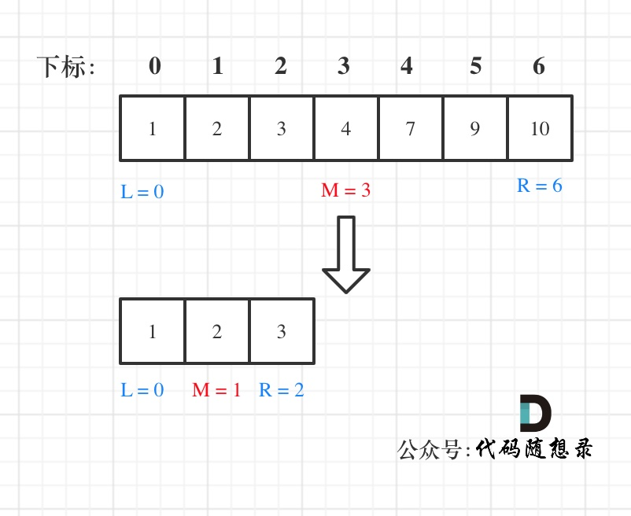
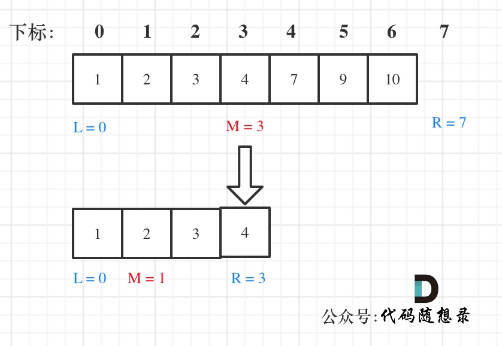

<!--来自代码随想录-->

### 二分法第一种写法

第一种写法，我们定义 target 是在一个在左闭右闭的区间里，**也就是[left, right] （这个很重要非常重要）**。

区间的定义这就决定了二分法的代码应该如何写，**因为定义target在[left, right]区间，所以有如下两点：**

* while (left <= right) 要使用 <= ，因为left == right是有意义的，所以使用 <=
* if (nums[middle] > target) right 要赋值为 middle - 1，因为当前这个nums[middle]一定不是target，那么接下来要查找的左区间结束下标位置就是 middle - 1

例如在数组：1,2,3,4,7,9,10中查找元素2，如图所示：



代码如下：（详细注释）

```CPP
// 版本一
class Solution {
public:
    int search(vector<int>& nums, int target) {
        int left = 0;
        int right = nums.size() - 1; // 定义target在左闭右闭的区间里，[left, right]
        while (left <= right) { // 当left==right，区间[left, right]依然有效，所以用 <=
            int middle = left + ((right - left) / 2);// 防止溢出 等同于(left + right)/2
            if (nums[middle] > target) {
                right = middle - 1; // target 在左区间，所以[left, middle - 1]
            } else if (nums[middle] < target) {
                left = middle + 1; // target 在右区间，所以[middle + 1, right]
            } else { // nums[middle] == target
                return middle; // 数组中找到目标值，直接返回下标
            }
        }
        // 未找到目标值
        return -1;
    }
};

```
* 时间复杂度：O(log n)
* 空间复杂度：O(1)


### 二分法第二种写法

如果说定义 target 是在一个在左闭右开的区间里，也就是[left, right) ，那么二分法的边界处理方式则截然不同。

有如下两点：

* while (left < right)，这里使用 < ,因为left == right在区间[left, right)是没有意义的
* if (nums[middle] > target) right 更新为 middle，因为当前nums[middle]不等于target，去左区间继续寻找，而寻找区间是左闭右开区间，所以right更新为middle，即：下一个查询区间不会去比较nums[middle]

在数组：1,2,3,4,7,9,10中查找元素2，如图所示：（**注意和方法一的区别**）



代码如下：（详细注释）

```CPP
// 版本二
class Solution {
public:
    int search(vector<int>& nums, int target) {
        int left = 0;
        int right = nums.size(); // 定义target在左闭右开的区间里，即：[left, right)
        while (left < right) { // 因为left == right的时候，在[left, right)是无效的空间，所以使用 <
            int middle = left + ((right - left) >> 1);
            if (nums[middle] > target) {
                right = middle; // target 在左区间，在[left, middle)中
            } else if (nums[middle] < target) {
                left = middle + 1; // target 在右区间，在[middle + 1, right)中
            } else { // nums[middle] == target
                return middle; // 数组中找到目标值，直接返回下标
            }
        }
        // 未找到目标值
        return -1;
    }
};
```
* 时间复杂度：O(log n)
* 空间复杂度：O(1)
